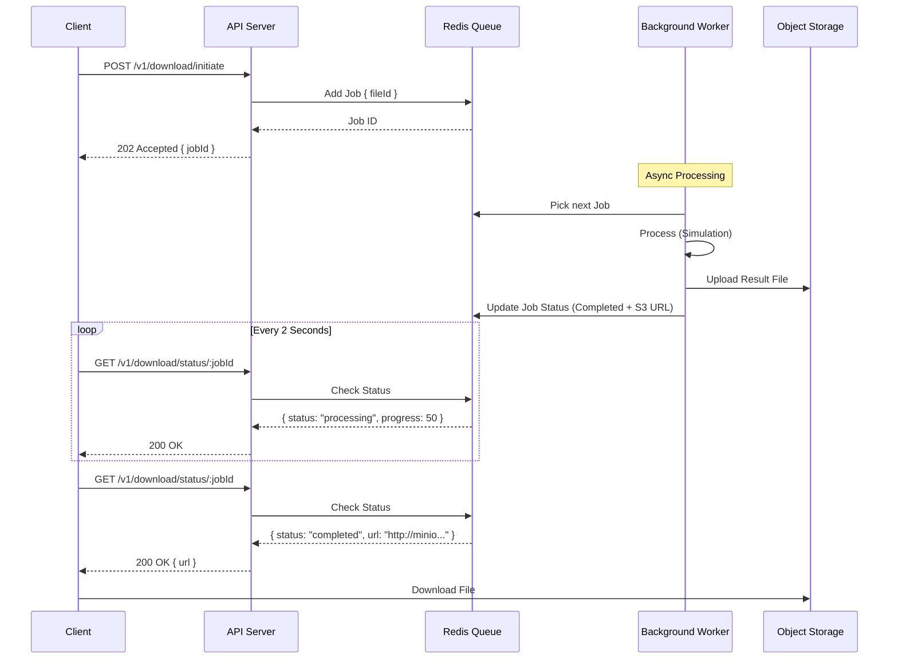

# Asynchronous Download Architecture

## 1. Architecture Diagram

## 2. Technical Approach: Option A (Polling)

We chose the Polling Pattern because:

*   **Reliability**: It completely eliminates connection timeouts. The initial HTTP request finishes in milliseconds.
*   **Resilience**: If the client disconnects (closes tab), the server continues processing the expensive job.
*   **Simplicity**: No complex WebSocket configurations required at the proxy layer (Cloudflare/Nginx).

## 3. Implementation Details
### API Contract Changes

*   **New Endpoint**: `POST /v1/download/initiate`
    *   **Input**: `{ "file_id": 12345 }`
    *   **Output**: `HTTP 202 Accepted`, `{ "jobId": "01HQ...", "status": "queued" }`

*   **New Endpoint**: `GET /v1/download/status/:jobId`
    *   **Output (Processing)**: `{ "status": "processing", "progress": 45 }`
    *   **Output (Done)**: `{ "status": "completed", "url": "https://...", "completedAt": "..." }`

### Data Schema (Redis/BullMQ)

*   **Job Data**: `{ fileId: number, delayMs: number }`
*   **Result Data**: `{ fileId: number, url: string, completedAt: string }`

### Background Strategy

*   **Library**: BullMQ
*   **Concurrency**: Configurable (default 5 concurrent downloads)
*   **Error Handling**: Jobs are retried 3 times with exponential backoff if the "simulation" fails.

## 4. Proxy Configuration (Example)

Since we use polling, standard configurations work.

**Nginx Config**:
```nginx
location /api {
    proxy_pass http://backend:3000;
    # Standard timeout is fine because requests return immediately
    proxy_read_timeout 30s;
}
```
## 5. Frontend Integration (React)

1.  **Initiate**: User clicks "Download". App calls `POST /initiate`.
2.  **State**: App enters `isLoading` state, stores `jobId`.
3.  **Poll**: `useEffect` hook runs `setInterval` (e.g., every 2000ms). Calls `GET /status/:jobId`.
4.  **Feedback**: Update a progress bar based on `response.progress`.
5.  **Completion**: When `status === 'completed'`, clear interval, show "Download Ready" button linking to `response.url`.

